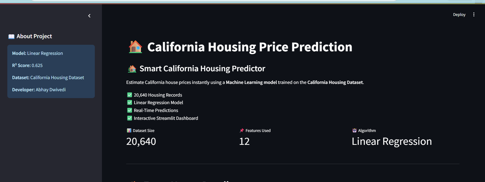
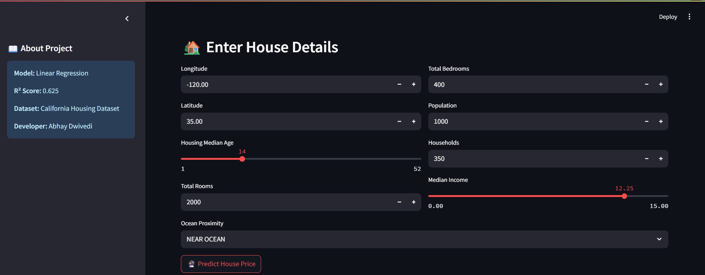
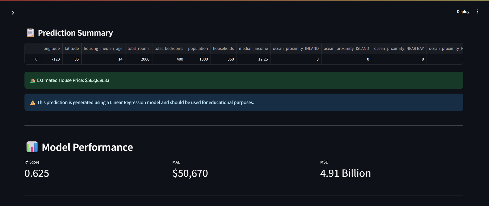
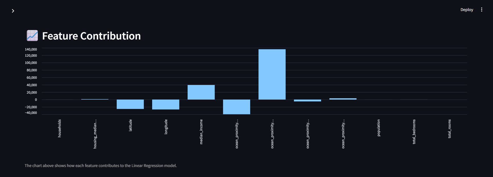

# 🏠 California Housing Price Prediction

An end-to-end Machine Learning application that predicts California housing prices using **Linear Regression** with an interactive **Streamlit** frontend.

🌐 **Live Demo:** https://california-housing-prediction-gvzgrmvloicoaebc45rina.streamlit.app/

---

## 📌 Project Overview

This project aims to predict California housing prices based on various demographic and housing-related features. The model was trained using the California Housing Dataset and deployed using Streamlit to provide real-time predictions through an interactive web interface.

---

## 🚀 Features

- 📊 Exploratory Data Analysis (EDA)
- 🧹 Data Preprocessing and Missing Value Handling
- 🔄 One-Hot Encoding for Categorical Features
- 🤖 Linear Regression Model Development
- 📈 Model Evaluation using R² Score, MAE, and MSE
- 💾 Model Serialization using Joblib
- 🌐 Interactive Streamlit Web Application
- ⚡ Real-Time House Price Prediction

---

## 📂 Dataset Information

- **Dataset:** California Housing Dataset
- **Number of Records:** 20,640
- **Features Used:** 12
- **Target Variable:** Median House Value

### Features Used:

- Longitude
- Latitude
- Housing Median Age
- Total Rooms
- Total Bedrooms
- Population
- Households
- Median Income
- Ocean Proximity (One-Hot Encoded)

---

## 🛠️ Tech Stack

| Category | Technologies |
|-----------|--------------|
| Programming Language | Python |
| Data Analysis | Pandas, NumPy,Matplotlib,Seabron |
| Machine Learning | Scikit-Learn |
| Model Persistence | Joblib |
| Frontend | Streamlit |
| Version Control | Git & GitHub |
| Deployment | Streamlit Community Cloud |

---

## 📊 Model Performance

| Metric | Value |
|---------|--------|
| R² Score | 0.625 |
| MAE | \$50,670 |
| MSE | 4.91 Billion |

---

## 🏗️ Project Workflow

```text
Data Collection
      ↓
Exploratory Data Analysis
      ↓
Data Preprocessing
      ↓
Feature Engineering
      ↓
Train-Test Split
      ↓
Linear Regression Model
      ↓
Model Evaluation
      ↓
Joblib Serialization
      ↓
Streamlit Frontend
      ↓
Deployment
```

---

## ⚙️ Installation

Clone the repository:

```bash
git clone https://github.com/AbhayDw/California-Housing-Prediction.git
```

Move into the project directory:

```bash
cd California-Housing-Prediction
```

Install dependencies:

```bash
pip install -r requirements.txt
```

Run the application:

```bash
streamlit run app.py
```

---

## ## 📸 Application Preview

### 🏠 Home Page



---

### 📥 Prediction Input



---

### 🔮 Prediction Output



---

### 📊 Feature Contribution Analysis



---

### 👨‍💻 Developer Information


## 👨‍💻 Developer

**Abhay Dwivedi**

- Computer Science Student
- Aspiring Data Scientist & ML Engineer
- Passionate about building practical AI solutions using Machine Learning.

### Connect with Me

- GitHub: https://github.com/AbhayDw
- LinkedIn: https://www.linkedin.com/in/abhay-dwivedi-6a8aa4279/

---

## ⭐ Future Improvements

- Implement Ridge and Lasso Regression
- Compare Multiple Regression Models
- Use Scikit-Learn Pipelines
- Add Advanced Visualizations
- Improve Model Performance

---

## 📜 License

This project is developed for educational and portfolio purposes.
